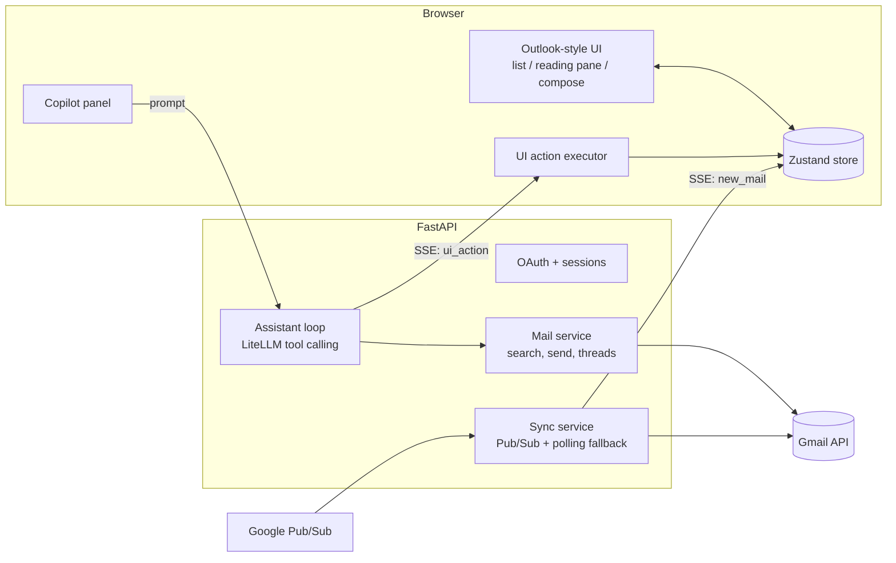

# AI-Powered Mail Web App

A Gmail web client with an Outlook Web-style UI (React + Fluent UI v9) and an AI Copilot that
controls the interface directly — searching, filtering, opening emails, and drafting replies by
emitting UI actions rather than replying with text alone.

**Live demo:** [your deployed URL]
**Demo video:** [your video link]

---

## 1. Setup — Run It Locally

### Prerequisites
- Python 3.12+, Node 20+
- A Google Cloud project with the **Gmail API** and **Cloud Pub/Sub API** enabled
- An LLM provider API key (Gemini, Groq, OpenAI, or Anthropic)

### Google OAuth setup
1. **APIs & Services → OAuth consent screen** → External → fill in app name and contact emails.
2. Add scopes: `gmail.modify`, `gmail.send`, `openid`, `userinfo.email`, `userinfo.profile`.
3. Under **Test users**, add every Google account that needs to log in (the app stays in
   Testing mode, so only listed accounts can authenticate).
4. **Credentials → Create OAuth client ID** (Web application):
   - Authorized redirect URI: `http://localhost:8000/auth/callback` (add your production URL too)

### Pub/Sub setup (optional for local dev)
Real-time push requires a public HTTPS endpoint. For local development, skip this and use
`SYNC_MODE=poll` instead (see below).
1. **Pub/Sub → Topics → Create topic**.
2. Grant `gmail-api-push@system.gserviceaccount.com` the **Pub/Sub Publisher** role on that topic.
3. Create a **push subscription** pointing to `https://<your-domain>/webhooks/gmail?secret=<secret>`.

### Environment variables
```bash
cp .env.example backend/.env
```
```env
SECRET_KEY=<random 32+ char string>
GOOGLE_CLIENT_ID=...
GOOGLE_CLIENT_SECRET=...
GOOGLE_REDIRECT_URI=http://localhost:8000/auth/callback

BASE_URL=http://localhost:8000
FRONTEND_URL=http://localhost:5173
COOKIE_SECURE=false
SYNC_MODE=poll          # use "pubsub" in production

LLM_MODEL=groq/llama-3.3-70b-versatile
GROQ_API_KEY=...
```

### Run
```bash
# Backend
cd backend
python -m venv .venv && .venv\Scripts\activate    # or source .venv/bin/activate
pip install -r requirements.txt
uvicorn app.main:app --reload --port 8000

# Frontend (separate terminal)
cd frontend
npm install
npm run dev
```
Open `http://localhost:5173` and sign in with a Google account you added as a test user.

### Tests
```bash
cd backend && .venv\Scripts\pytest -v
cd frontend && npm test
```

---

## 2. Architecture



**The core idea:** the human and the assistant drive the *same* Zustand store through the *same*
actions. A click on a filter dropdown and the assistant calling `set_filters(...)` both end up
mutating identical state, so the main UI always reflects what either party did — the assistant
never touches the DOM or renders its own UI.

### Key decisions and trade-offs

- **UI tools instead of DOM control.** The assistant emits typed actions (`set_filters`,
  `open_email`, `open_compose`, `fill_compose`, `propose_send`, ...) over SSE. The frontend applies
  them to the store through a single queued executor, so actions always run in order and the UI
  stays consistent whether a human or the assistant triggered the change. Trade-off: every new UI
  capability needs an explicit tool, but this keeps the assistant's power bounded and testable.
- **Human-in-the-loop send.** There is no `send_email` tool. The model can only reach
  `propose_send()`, which renders a confirmation card; sending happens only on an explicit click.
  This also blocks a class of prompt-injection risk — a malicious email body can't make the
  assistant send anything on its own.
- **One shared query builder.** UI filter chips, the search bar, and the assistant's
  `search_emails` tool all go through the same `build_gmail_query()` function, so "last 10 days"
  from a human and from the assistant always resolve to the same Gmail query syntax.
- **SSE, not WebSockets.** The assistant stream and the live-mail stream are both one-directional
  (server → client), so plain SSE over HTTP keeps things simpler than a WebSocket, with cookie auth
  and automatic reconnection for free.
- **Dual sync mode.** Production uses Gmail push via Pub/Sub; local development falls back to
  polling `history.list` every 15 seconds, so no public URL or tunnel is needed to develop.
- **Single deployable service.** A multi-stage Docker build compiles the React app and serves it
  from FastAPI, so there's one process and one URL instead of coordinating two hosts.
- **SQLite on a persistent disk.** Zero setup for this scope, with tokens and sync state surviving
  restarts via a mounted volume. A multi-instance deployment would need Postgres instead, since the
  live-mail broadcaster is currently in-process memory and won't fan out across replicas.
- **LiteLLM as the model layer.** Swapping `LLM_MODEL` switches providers with no code changes.
  Model choice matters here — not every provider/model supports tool calling, so this needs
  checking per provider (see Known limitations).

### Known limitations
- OAuth is in Google's Testing mode, so only accounts added as test users can sign in.
- The live-mail broadcaster is in-memory per process; a multi-instance deploy needs a shared
  pub/sub layer (e.g. Redis) instead.
- Email bodies passed to the model are untrusted input; the human-in-the-loop send guard is the
  primary defense against prompt injection via email content.

---

## 3. Demo — Assistant Controlling the UI

[Add 3–5 screenshots or a short screen recording here showing:]
1. "Send an email to X..." → compose opens and fields fill in visibly, followed by the confirm card
2. "Show me emails from the last 10 days" → the main list and filter chips update
3. "Open the latest email from David" → the detail view opens
4. An email open, then "reply to this" → reply drafted from context
5. "Show only unread emails from this week" → filters applied

---

## 4. What I'd Improve With More Time

- Multi-account support (linking more than one Gmail/Outlook inbox per user)
- Local full-text search over cached email bodies for instant search without hitting Gmail
- Semantic search over past emails (e.g. "when did we last discuss the pricing contract")
- Drag-and-drop attachment uploads in compose
- Playwright end-to-end tests covering prompt → tool call → UI update, with the LLM mocked
- Move the live-mail broadcaster to Redis pub/sub to support multiple server instances